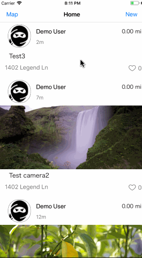

# Project 4 - *NearMe*

Time spent: **60** hours spent in total

## User Stories

NearMe is an app to allow users to post and discover nearby happenings. Users can post happenings with hashtags and photos from camera and the app will load the messages from db as happening feeds. (optional: When a user clicks on a hashtag, all related twitter and instagram hashtag posts will be pulled from their APIs and will be displayed in timeline mode.)

The following **required** functionality is completed:

Back End:
- [x] Setup and configure Firebase server-side data store
- [x] Design your database schema and generated model objects with initial fields

Login screen: none
- [x] no login required

Home screen:
- [x] User can view a list of nearby posts/messages/…
- [ ] User can view post details by tapping on a cell. (go to detail view)
- [ ] Search results page (not from server, search in ui only)
- [x] Table rows should be dynamic height according to the content height.
- [x] Custom cells should have the proper Auto Layout constraints.
- [ ] Search bar should be only be shown when needed

Post details screen:
- [ ] map view
- [ ] image view

optional:
- [ ] reply function

Compose screen:
- [x] refer to twitter assignment
- [x] camera/upload photo to firebase

Filter screen:

- [ ] The filters you should actually have are: sort(distance, most liked), distance
- [ ] The filters table should be organized into sections.
- [ ] You can use the default UISwitch for on/off states.
- [ ] Clicking on the "Search" button should dismiss the filters page and trigger the search w/ the new filter settings.

The following **additional** features are implemented:

Compose screen:
- [ ] pop up instead of new screen

- [ ] Hashtag messages screen:
 - [ ] pull messages with hashtag from facebook&twitter

## Video Walkthrough

Here's a walkthrough of implemented user stories:

GIF created with [LiceCap](http://www.cockos.com/licecap/).

## Notes

Describe any challenges encountered while building the app.

## License

    Copyright [2017] [YCY team]

    Licensed under the Apache License, Version 2.0 (the "License");
    you may not use this file except in compliance with the License.
    You may obtain a copy of the License at

        http://www.apache.org/licenses/LICENSE-2.0

    Unless required by applicable law or agreed to in writing, software
    distributed under the License is distributed on an "AS IS" BASIS,
    WITHOUT WARRANTIES OR CONDITIONS OF ANY KIND, either express or implied.
    See the License for the specific language governing permissions and
    limitations under the License.
